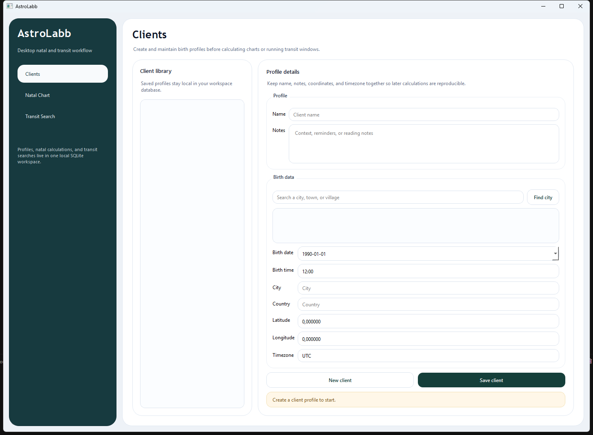

# AstroLabb

AstroLabb is an open-source desktop astrology app built with Python and PySide6 for local natal chart work, client profile management, and transit-to-natal searches.

## Get AstroLabb

[Download The Latest Windows Installer](https://github.com/krapcys1-maker/astroapp/releases/latest)

Use only the file named `AstroLabb-Setup-<version>.exe`.

- Download the `.exe` installer if you want the app
- Ignore `Source code (zip)` and `Source code (tar.gz)` unless you want the raw project files
- Windows may show SmartScreen or browser trust warnings because the installer is not code-signed yet
- If SmartScreen appears, click `More info` and then `Run anyway`
- If the browser says the file is not commonly downloaded, keep the file only if it came from this repository's Releases page

## Download For Windows

Download the current installer from [Releases](https://github.com/krapcys1-maker/astroapp/releases/latest) and use the file named `AstroLabb-Setup-<version>.exe`.

- Download only the `.exe` installer if you want to install the app
- Do not download `Source code (zip)` or `Source code (tar.gz)` unless you want the raw project files
- Because the installer is not code-signed yet, Windows or the browser may show security warnings before launch
- If SmartScreen appears, click `More info` and then `Run anyway`
- If the browser says the file is not commonly downloaded, keep the file and continue only if it came from this repository's Releases page

The installer creates shortcuts and stores app data locally on your machine. New installer versions can also ask for a custom installation folder.

## Preview



## What You Can Do

- Save local client profiles with birth date, time, coordinates, timezone, and notes
- Search cities and auto-fill coordinates plus timezone from the built-in lookup flow
- Calculate natal charts with planets, houses, aspects, and a rendered chart wheel
- Overlay current or selected transits on top of the natal wheel
- Search transit windows across a date range with body and aspect filters
- Export natal charts to PNG

## Windows Installer

The project now includes a Windows installer build pipeline that packages:

- the desktop app executable
- bundled SVG symbol assets used by the chart renderer
- bundled Swiss Ephemeris data shipped with the app resources
- Start Menu and desktop shortcuts created during installation

Installed app data is stored in the current user's local application data directory instead of the install folder, so the app keeps working correctly after installation and updates.

## Installation

1. Open the latest release page.
2. Download `AstroLabb-Setup-<version>.exe`.
3. Launch the installer.
4. Choose the default install location or pick your own folder.
5. If Windows shows a security prompt, use `More info` and then `Run anyway`.
6. Start AstroLabb from the desktop shortcut or Start Menu.

## Download And Test

When a Windows release is published, download the latest installer from the GitHub Releases page and launch `AstroLabb-Setup-<version>.exe`.

Please download it, test the workflows, and report anything broken or unclear. Bug reports with reproduction steps, screenshots, and sample inputs are especially helpful.

## Reporting Bugs

- Open a GitHub issue in this repository
- Include the app version and Windows version
- Describe what you expected to happen
- Describe what actually happened
- Add screenshots or exported files if they help

A ready-to-use issue template is included in `.github/ISSUE_TEMPLATE/bug_report.md`.

## Local Development

Create a virtual environment and install the development stack:

```powershell
python -m venv .venv
.venv\Scripts\Activate.ps1
pip install -e .[dev,astro,geo]
```

Run the desktop app:

```powershell
python -m app.main
```

Run tests and linting:

```powershell
pytest
ruff check .
```

Build the Windows installer locally:

```powershell
powershell -ExecutionPolicy Bypass -File .\scripts\build_windows_installer.ps1
```

## Release Workflow

The repository includes a GitHub Actions workflow that can build the Windows installer on `windows-latest`.

- Manual build: run the `windows-release` workflow from the Actions tab
- Tagged release: push a tag like `v0.1.0` to build the installer and attach it to a GitHub Release

The default release body template lives in [docs/release-template-pl.md](docs/release-template-pl.md).

## Privacy

AstroLabb stores its SQLite database and bundled ephemeris files locally on the user's machine. The app does not require a hosted backend for the main desktop workflows.

## Credits And License

- App license: AGPL-3.0-or-later
- Swiss Ephemeris data is distributed under the licensing terms already required by the project stack
- The bundled astrology SVG symbol template is based on assets from the AGPL-licensed `kerykeion` project

See [LICENSE](LICENSE) for the repository license text.
